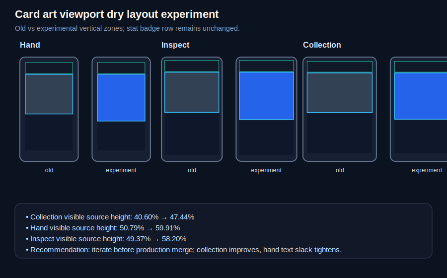

# Card art viewport dry layout experiment

Date: 2026-05-17

## Scope

This is a controlled, non-destructive layout experiment for evaluating a modest universal increase to the production card artwork viewport. It does not change centered cover-crop behavior, source-art assumptions, per-card offsets, stat badge glyph rules, gameplay rules, or horizontal spacing.

The experiment keeps the stat badge row allocation stable and borrows vertical space from the lower text/name allocations:

| Zone ratio | Previous | Experiment |
| --- | ---: | ---: |
| Stat badges | `0.112` | `0.112` |
| Name | `0.135` | `0.126` |
| Rules text | `0.315` | `0.252` |

The `art` ratio remains a documentation signal only; the runtime artwork height is still the remaining inner height after stat, name, text, and fixed gaps are allocated.

## Mockup

## Runtime crop metrics

Representative viewport: `390 x 844` portrait. Source art: `512 x 768`. Crop is still centered cover-crop with no per-card offsets.

### Old vs experimental crop comparison

| Mode | Card size | Artwork viewport old | Artwork viewport experiment | Visible source range old | Visible source range experiment | Visible source height old | Visible source height experiment | Delta |
| --- | ---: | ---: | ---: | ---: | ---: | ---: | ---: | ---: |
| Hand | `107.01 x 191.38` | `95.01 x 72.38` | `95.01 x 85.38` | `y 188.97-579.03` | `y 153.94-614.06` | `50.79%` | `59.91%` | `+9.12pp` |
| Hand inspect | `220.44 x 378.48` | `196.44 x 145.48` | `196.44 x 171.48` | `y 194.41-573.59` | `y 160.53-607.47` | `49.37%` | `58.20%` | `+8.82pp` |
| Collection | `176 x 250` | `156 x 95` | `156 x 111` | `y 228.10-539.90` | `y 201.85-566.15` | `40.60%` | `47.44%` | `+6.84pp` |

### Experimental visible-source loss

| Mode | Lost top | Lost bottom | Lost left/right |
| --- | ---: | ---: | ---: |
| Hand | `20.04%` | `20.04%` | `0% / 0%` |
| Hand inspect | `20.90%` | `20.90%` | `0% / 0%` |
| Collection | `26.28%` | `26.28%` | `0% / 0%` |

## Gameplay readability assessment

### Stat readability

Stat row allocation is intentionally unchanged. On the representative collection card, the stat row remains `26px`, preserving the previous stat badge sizing envelope. Hand and inspect stat rows likewise remain at their previous rounded heights (`20px` and `40px`).

Assessment: stat readability is preserved.

### Name and rules text readability

The experiment compresses lower-card vertical allocations:

| Mode | Name old -> experiment | Rules text old -> experiment |
| --- | ---: | ---: |
| Hand | `24px -> 23px` | `57px -> 45px` |
| Hand inspect | `48px -> 45px` | `112px -> 89px` |
| Collection | `31px -> 29px` | `72px -> 58px` |

Name readability remains likely acceptable because the name allocation only changes modestly. Rules text is the main risk: the renderer can still fit short ability text, but cards with longer localized text, inline stat symbols, or keyword-heavy copy have less vertical slack. This is especially relevant in hand cards, where tactical scanning is already compact.

Assessment: readable for short MVP card text, but the experiment consumes too much text-panel safety margin to be accepted as-is without visual QA across English and Polish.

### Keyword and icon readability

Inline stat/gameplay symbols keep their existing font and icon scaling. However, the lower max-height means long keyword lines may reach the existing minimum font size sooner. The experiment does not shrink typography by design, but it gives the text fitter less space.

Assessment: keyword readability is probably acceptable for short lines; longer effects need screenshot validation before production merge.

### Card hierarchy and artwork balance

Collection improves from an aggressive `40.60%` visible source height to `47.44%`, which meaningfully improves face, silhouette, gesture, and upper-body survivability while still cropping enough that cards do not become cinematic full-art cards. Hand and inspect move to nearly `58-60%`, which is a larger jump than the requested “slightly higher” side effect.

Assessment: collection is closer to the desired viability range, but hand/inspect may now feel somewhat artwork-heavy relative to gameplay text.

### Mobile hand readability

The hand card artwork viewport gains `13px` of height on a `107px`-wide hand card. This materially helps illustration recognition, but the hand text area loses `12px`. The gameplay risk is that players may scan art more easily but parse effects less comfortably in the primary tactical surface.

Assessment: improved art read; potential tactical-readability regression for text-dense cards.

### Collection readability

Collection is the clearest beneficiary. The experiment recovers about `26px` of source height at the top and bottom, reducing source loss from `29.70%` per side to `26.28%` per side. This makes collection thumbnails better aligned with the source-art pipeline while staying below full-art presentation.

Assessment: worth pursuing.

## Recommendation

Do not merge this exact ratio set directly to production yet. The experiment proves that a small systemic layout change can substantially improve collection art readability, but the shared-layout side effect pushes hand and inspect visibility close to `60%` and removes a notable amount of rules-text slack.

Recommended next step: further iterate with one of these safer variants:

1. Keep the stat row fixed and recover a smaller amount of art height globally, accepting collection around the mid-40% range; or
2. Keep the shared crop behavior, but add a card-mode layout preset so collection can reach roughly `48-52%` without forcing hand/inspect to nearly `60%`.

Production recommendation: further iterate rather than merging this exact dry experiment. The direction is promising for the art pipeline, especially collection, but the final production change should protect hand-card tactical text readability more aggressively.
